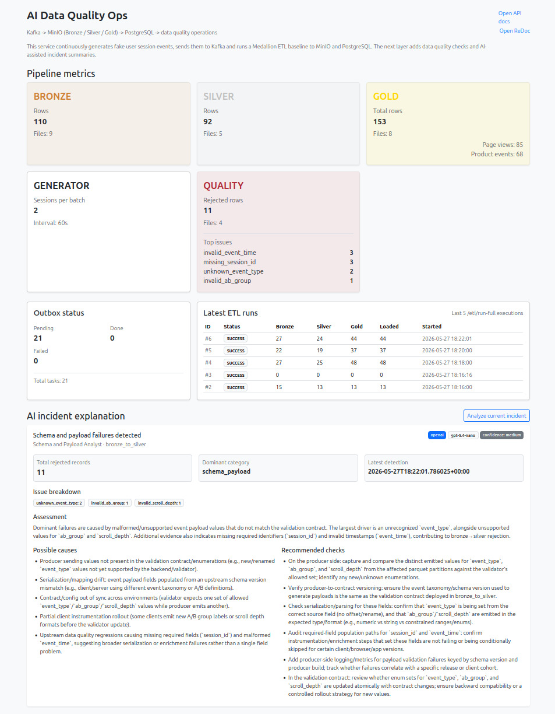

# AI Data Quality Ops

This repository is an extension of my earlier Medallion pipeline project: [Data Flow](https://github.com/dema-git/data-flow).

The original project handles the base data flow: synthetic events, Kafka, MinIO Bronze/Silver/Gold layers, Airflow ETL, PostgreSQL marts, dashboarding, operational endpoints, Docker Compose, tests, and CI.

This version keeps that baseline and adds a data-quality ops layer:

- controlled bad-data generation
- deterministic validation before Silver
- quarantine reports for rejected records
- incident reports built from validation results
- rule-based routing to a specialist incident profile
- optional OpenAI explanation for the current incident

The AI part is deliberately kept out of the validation path. The code decides what is valid or invalid. The model only receives an already-built incident report and turns it into an operator-facing explanation.

## Scope

- Medallion-style data pipeline with Bronze, Silver, and Gold layers
- deterministic data-quality validation before Silver promotion
- quarantine bucket for rejected records
- incident aggregation from validation facts
- rule-based agent routing by dominant issue category
- mock and real OpenAI execution modes
- structured JSON-schema response from the OpenAI Responses API
- protected operational endpoints
- dashboard with quality and AI incident sections
- Docker Compose local stack, Makefile, tests, and GitHub Actions CI

## Architecture


Flow:

```text
Synthetic generator
  -> Kafka
  -> Bronze Parquet in MinIO
  -> deterministic validation
      -> valid rows: Silver -> Gold -> PostgreSQL
      -> invalid rows: events-quality-issues quarantine bucket
  -> quality summary
  -> incident report
  -> rule-based agent router
  -> mock or OpenAI incident explanation
  -> API / dashboard
```

Main services:

- **FastAPI**: API, dashboard, generator startup, Kafka consumer startup, quality APIs, and AI incident explanation endpoints.
- **Kafka**: transport for generated session events.
- **MinIO**: object storage for Bronze, Silver, Gold, archive, and quality issue buckets.
- **Airflow**: runs ETL, archive, and cleanup DAGs.
- **PostgreSQL**: stores Gold marts and pipeline metadata.
- **Kafdrop / pgAdmin / MinIO Console**: local inspection tools.
- **GitHub Actions**: runs the Docker-based test suite on push and pull request.

## Project Structure

```text
.
├── airflow/dags/                 # Airflow DAGs and shared HTTP client
├── docs/                         # Local verification notes
├── init-db/                      # Airflow database initialization
├── readme_assets/                # README screenshots and diagrams
├── scripts/                      # Kafka, MinIO, CI, and DB init scripts
│   └── init/                     # PostgreSQL schema initialization
├── services/
│   ├── faker/                    # Synthetic event generator and bad-data injection
│   ├── fastapi_app/              # FastAPI app, routes, dashboard, services
│   │   ├── agent_definitions/    # Markdown profiles for incident agents
│   │   ├── api/                  # API and dashboard routes
│   │   ├── services/             # Medallion, quality, incident, AI services
│   │   └── templates/            # Dashboard templates and HTMX partials
│   ├── init-topic/               # Kafka topic initialization image
│   ├── kafka/                    # Kafka producer/consumer helpers
│   ├── medallion_models/         # Bronze/Silver/Gold/quality dataclasses
│   └── minio-init/               # MinIO bucket initialization image
├── tests/                        # Docker-based pytest suite
├── docker-compose.infra.yml      # Kafka, MinIO, PostgreSQL, pgAdmin, Kafdrop
├── docker-compose.app.yml        # FastAPI application service
├── docker-compose.airflow.yml    # Airflow scheduler/webserver/api/dag-processor
├── docker-compose.tests.yml      # Test runner compose file
├── Makefile                      # Local developer commands
└── .github/workflows/ci.yml      # GitHub Actions CI
```

Runtime folders are created locally and are intentionally not part of the source code:

```text
pgdata/
minio-data/
shared_logs/
```

Use `make clean CONFIRM=1` to remove them.

## Data Flow

1. FastAPI starts a background generator.
2. The generator creates synthetic user session events.
3. Events are sent to Kafka.
4. A Kafka consumer writes incoming events to Bronze Parquet files in MinIO.
5. Airflow triggers the full ETL flow.
6. Bronze files are validated before promotion.
7. Valid records become Silver records.
8. Invalid records are written to `events-quality-issues`.
9. Silver files are transformed into Gold datasets:
   - `gold_page_views`
   - `gold_product_events`
10. Gold data is loaded into PostgreSQL.
11. File lifecycle work is tracked in `pipeline.outbox_tasks`.
12. Archive and cleanup DAGs move/remove processed files.

## Data Quality

Bad data injection is controlled by:

```env
GENERATOR_BAD_DATA_RATE=0.05
```

Example issue types:

- `missing_session_id`
- `invalid_event_time`
- `negative_price`
- `unknown_event_type`
- `purchase_without_product`
- `invalid_extra_payload`
- `invalid_scroll_depth`
- `invalid_ab_group`

Validation runs before Bronze data is promoted to Silver. Invalid records do not stop the whole ETL run. They are quarantined as structured quality issue records with:

- detected timestamp
- issue type
- issue field
- severity
- source object name
- original injected issue marker, when available

The quality summary endpoint aggregates these records:

```http
GET /quality/issues/summary
```

## Incident Routing

Quality issues are grouped into incident categories. The current categories are:

- `schema_payload`
- `business_rules`
- `session_integrity`
- `timestamp_quality`
- `unclassified`

The router selects one specialist profile based on the dominant category:

```text
services/fastapi_app/services/medallion_pipeline/incident_agent_router.py
```

Agent profiles live as markdown files:

```text
services/fastapi_app/agent_definitions/quality_incidents/
```

The pattern is:

```text
deterministic validation + rule-based agent routing + structured LLM output
```

## AI Incident Explanation

The incident explanation can run in two modes:

```env
AI_INCIDENT_ANALYSIS_MODE=mock
```

or:

```env
AI_INCIDENT_ANALYSIS_MODE=openai
```

### Mock Mode

Mock mode is the default. It does not require an API key and does not call OpenAI.

Use it for local development, tests, demos, and screenshots:

```env
AI_INCIDENT_ANALYSIS_MODE=mock
OPENAI_MODEL=gpt-5.4-nano
OPENAI_MAX_OUTPUT_TOKENS=800
OPENAI_REQUEST_TIMEOUT_SECONDS=30
```

### OpenAI Mode

OpenAI mode calls the OpenAI Responses API from the server side.

Put the key only in your local `.env` file:

```env
AI_INCIDENT_ANALYSIS_MODE=openai
OPENAI_API_KEY=your-api-key
OPENAI_MODEL=gpt-5.4-nano
OPENAI_MAX_OUTPUT_TOKENS=800
OPENAI_REQUEST_TIMEOUT_SECONDS=30
```

Do not commit `.env`. The repository tracks only `.env.example`.

`OPENAI_MAX_OUTPUT_TOKENS` limits each generated explanation, which keeps manual testing cheaper and more predictable.

The model receives a compact incident context, not raw Parquet files and not the whole event stream. The request contains:

- selected agent instructions
- incident title
- impacted pipeline stage
- total issue count
- dominant category
- issue-type counts
- recent evidence

The model must return structured JSON:

```json
{
  "assessment": "string",
  "observed_facts": ["string"],
  "possible_causes": ["string"],
  "recommended_checks": ["string"],
  "confidence": "low | medium | high"
}
```

The OpenAI call is implemented here:

```text
services/fastapi_app/services/medallion_pipeline/ai_incident_service.py
```

## Dashboard

Dashboard:

```text
http://localhost:8000/
```

It shows:

- Bronze / Silver / Gold file and row counts
- generator settings
- quality issue count and top issue types
- latest 5 ETL runs
- outbox status counts
- manual AI incident explanation section
- links to Swagger UI and ReDoc

The AI dashboard block is manual. It does not auto-refresh and does not call OpenAI on every dashboard poll. In `openai` mode, one click on `Analyze current incident` means one model request.



## API Docs

FastAPI docs:

```text
http://localhost:8000/docs
http://localhost:8000/redoc
```


Main endpoint groups:

- analytics endpoints
- demo data inspection endpoints
- quality summary endpoints
- incident and AI explanation endpoints
- protected operational endpoints
- dashboard partial endpoints

## Protected Operational Endpoints

Operational endpoints that change pipeline state require a token:

```env
OPERATIONAL_API_TOKEN=medallion-ops-token
```

Request header:

```http
X-API-Token: medallion-ops-token
```

Example:

```bash
curl -H "X-API-Token: medallion-ops-token" http://localhost:8000/etl/run-full
```

Protected endpoints:

- `GET /etl/run-full`
- `GET /outbox/archive-run`
- `GET /bronze-archive/cleanup`
- `GET /silver-archive/cleanup`
- `POST /quality/incidents/current/explanation`

Airflow DAGs use a shared HTTP client that reads `OPERATIONAL_API_TOKEN` from the container environment and injects `X-API-Token` automatically. Manual calls through Swagger, browser, or `curl` must provide the header explicitly.

This is a local safety guard, not a production auth system.

## Local Setup

Requirements:

- Docker
- Docker Compose
- Make

Create the local env file:

```bash
cp .env.example .env
```

Start everything:

```bash
make up
```

Check containers:

```bash
make ps
```

Useful local URLs:

```text
FastAPI dashboard: http://localhost:8000/
Swagger UI:        http://localhost:8000/docs
Airflow:           http://localhost:8080/
MinIO console:     http://localhost:9101/
Kafdrop:           http://localhost:9000/
pgAdmin:           http://localhost:8889/
```

If another project already uses these ports, override them:

```bash
API_APP_PORT=8001 \
POSTGRES_PORTS=5445:5432 \
PGADMIN_PORTS=8890:80 \
MINIO_API_PORT_EXTERNAL=9200 \
MINIO_CONSOLE_PORT_EXTERNAL=9201 \
AIRFLOW_WEBSERVER_PORT=8180 \
make up
```

Clean local runtime state:

```bash
make clean CONFIRM=1
```

This removes Docker volumes and local runtime folders such as `pgdata`, `minio-data`, and `shared_logs`.

## Local Verification

Baseline verification:

```bash
cp .env.example .env
make clean CONFIRM=1
make up
make ps
make test
```

Then check:

- dashboard opens at `http://localhost:8000/`
- Swagger opens at `http://localhost:8000/docs`
- protected endpoints return `401` without `X-API-Token`
- protected endpoints work with `X-API-Token: medallion-ops-token`
- Airflow DAGs can call protected endpoints automatically
- latest ETL runs appear in the dashboard
- quality issue summary works at `/quality/issues/summary`

To verify the AI flow:

1. Use mock mode first:

```env
AI_INCIDENT_ANALYSIS_MODE=mock
GENERATOR_BAD_DATA_RATE=0.05
```

2. Start from clean state:

```bash
make clean CONFIRM=1
make up
```

3. Wait until quality issues appear on the dashboard.
4. Click `Analyze current incident`.

To verify OpenAI mode:

```env
AI_INCIDENT_ANALYSIS_MODE=openai
OPENAI_API_KEY=your-api-key
OPENAI_MODEL=gpt-5.4-nano
OPENAI_MAX_OUTPUT_TOKENS=800
```

Then click `Analyze current incident` once. The dashboard should show provider `openai`, the configured model, confidence, assessment, possible causes, and recommended checks.

Detailed verification steps are in [docs/local-verification.md](docs/local-verification.md).

## Makefile

```text
make up       Build and start the full local stack
make ps       Show service status
make logs     Follow logs for all services
make test     Run the Docker test suite
make down     Stop the local stack
make clean    Stop stack and remove local runtime state
```

## Tests

Run tests:

```bash
make test
```

The tests run in Docker through `docker-compose.tests.yml`.

Current tests cover:

- database URL configuration
- Kafka consumer configuration
- MinIO manager behavior with dummy clients
- Medallion idempotency checks
- deterministic quality validation
- controlled bad-data injection
- quality summary aggregation
- incident report construction
- agent routing
- mock/OpenAI incident service behavior
- dashboard incident explanation route
- operational API token validation

## CI

The GitHub Actions workflow runs on push and pull request to `main`.

It does four things:

1. checks that local `.env` files are not tracked
2. creates `.env` from `.env.example`
3. validates `docker-compose.tests.yml`
4. runs `make test`

Workflow file:

```text
.github/workflows/ci.yml
```

## Main Endpoints

Analytics:

- `GET /analytics/top-landing-pages`
- `GET /analytics/top-products`
- `GET /analytics/ab-test-summary`
- `GET /analytics/user/{user_id}/sessions`

Demo data:

- `GET /faker/sample-session`
- `GET /faker/sample-batch`

Operational:

- `GET /etl/run-full`
- `GET /outbox/archive-run`
- `GET /bronze-archive/cleanup`
- `GET /silver-archive/cleanup`

Quality and incidents:

- `GET /quality/issues/summary`
- `POST /quality/incidents/current/explanation`

Dashboard:

- `GET /`
- `GET /dashboard/metrics`
- `GET /dashboard/operations`
- `POST /dashboard/quality/incident-explanation`

## Reliability Details

### Idempotency

The ETL code checks existing archive outbox records before processing files. This prevents the same active file from being processed twice if `/etl/run-full` is triggered again before the archive worker has moved it.

### ETL Run History

Each `/etl/run-full` call creates a row in `pipeline.etl_runs`.

The dashboard shows the latest runs with:

- status
- Bronze row count
- Silver row count
- Gold row count
- loaded row count
- start time

### Outbox

`pipeline.outbox_tasks` tracks file lifecycle work. Archive workers use it to decide which files should be moved and whether each task is `PENDING`, `IN_PROGRESS`, `DONE`, or `FAILED`.

### Docker Build Context

The repository includes `.dockerignore` so Docker builds do not receive `.git`, local env files, caches, logs, or local runtime data.

## Current Scope

The project is local-first. The focus is pipeline behavior, quality operations, and a small AI layer on top of deterministic reports.

Implemented:

- Medallion pipeline baseline inherited from the original project
- controlled invalid event injection
- deterministic validation and quarantine
- quality issue aggregation
- incident report construction
- rule-based specialist agent routing
- mock and OpenAI explanation modes
- dashboard display for quality and AI incident output
- protected operational endpoints
- Docker Compose, Makefile, tests, and CI

## Limitations

Things intentionally left out:

- Alembic migrations
- full user auth and roles
- production secrets management
- distributed locking for multiple ETL workers
- full end-to-end integration tests for the entire stack
- real S3 lifecycle policies
- deployment manifests
- automatic AI remediation actions

The scope stays around local reproducibility, deterministic pipeline behavior, data-quality operations, and structured incident explanations.
